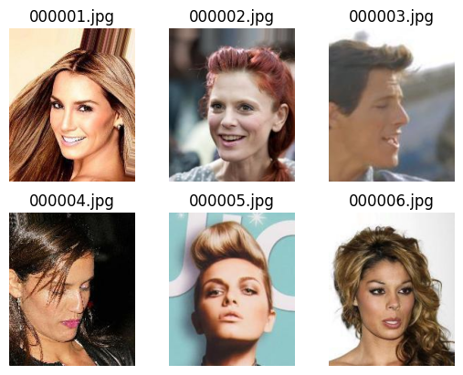
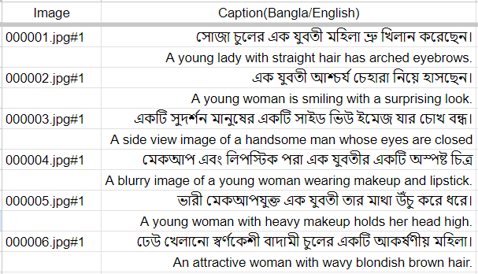
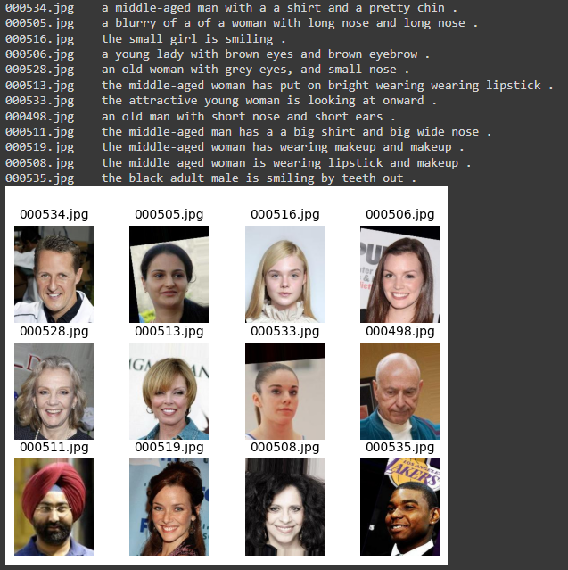
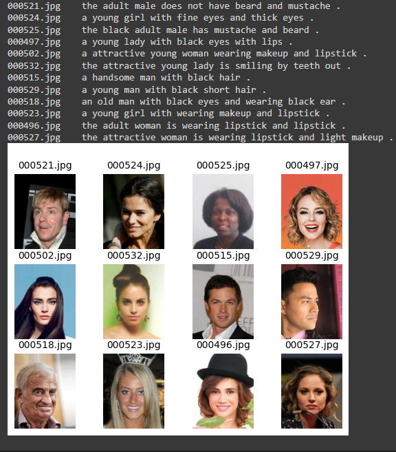
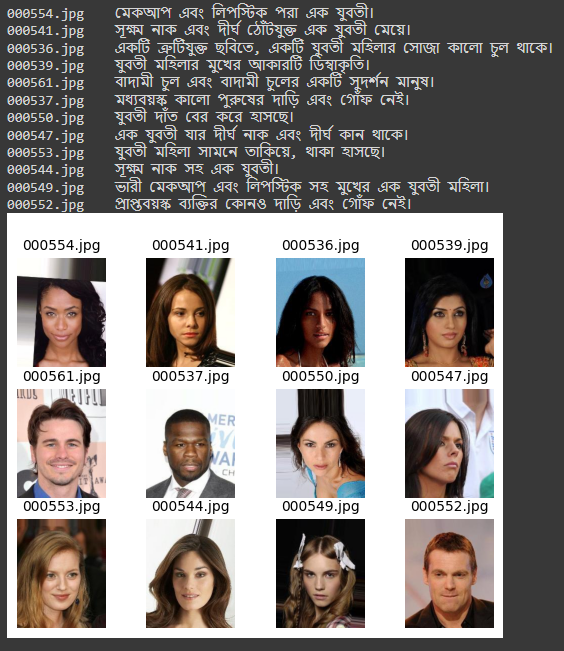
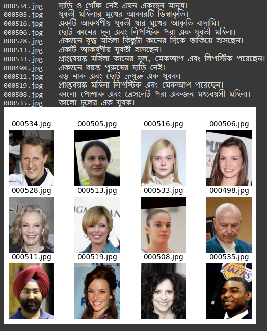

# Enhancing Face Captioning using facial attributes

This project aims to enhance the face captioning process by incorporating facial attributes. The notebook titled `(5)imagecaptioning_ResNet50_epoch200_English.ipynb` contains the code for this project.

## Table of Contents

- [Introduction](#introduction)
- [Dataset](#dataset)
- [Dependencies](#dependencies)
- [Image Preprocess](#image-preprocess)
- [Text Preprocess](#text-preprocess)
- [Visualize Images with Captions](#visualize-images-with-captions)
- [Create Vocabulary](#create-vocabulary)
- [Build Generator Function](#build-generator-function)
- [Model](#model)
- [Predictions](#predictions)

## Introduction

The goal of this project is to generate accurate and descriptive captions for facial images using a combination of facial attributes and natural language processing techniques. By incorporating facial attributes, the model can generate more contextually relevant captions for each image.

## Dataset
The FaceCaption dataset is a curated collection specifically created for the purpose of research in the field of facial attribute captioning. It consists of 2,000 portrait images sourced from the CelebA dataset, showcasing a diverse range of facial characteristics such as age, gender, expression, and hair color. The dataset includes five captions per image, providing both English and Google-translated Bangla versions.

The dataset is designed to facilitate the exploration of multilingual caption generation on portrait images. Each image in the dataset is accompanied by descriptive and informative captions that accurately describe the visual characteristics present in the image. The captions were generated based on the attribute annotations available in the CelebA dataset, ensuring a close alignment between the captions and the visual attributes.

The images in the BanglaFaceCaption dataset are conveniently stored in a single folder, making them easily accessible for training and evaluation purposes. Additionally, an accompanying Excel sheet is provided, linking each image file with its corresponding English and Bangla captions.

While the current version of the dataset comprises 2,000 images with five captions each, future work aims to expand the dataset size to enhance the diversity and robustness of models trained on it. The BanglaFaceCaption dataset serves as a valuable resource for researchers and practitioners interested in advancing the field of facial attribute captioning and exploring multilingual caption generation capabilities.
### Download
<a id="raw-url" href="https://zenodo.org/record/8144361">Download Dataset</a>
### Cite as
Cite as
Naimul Haque, & Abida Sultana. (2023),
FaceAttDB: A Multilingual Dataset for Facial Attribute Captioning [Data set]. Zenodo. doi: 10.5281/zenodo.8144361

### Preview

## Dependencies

To run this project, the following dependencies are required:

- `numpy`
- `pandas`
- `cv2`
- `glob`
- `google.colab`
- `matplotlib`
- `keras`
- `keras_applications`
- `tensorflow`

Please make sure you have these dependencies installed before running the notebook.

## Image Preprocess

This section of the notebook focuses on preprocessing the facial images. It includes the following steps:

1. Mounting Google Drive to access image data.
2. Loading and displaying sample images.
3. Installing and importing the necessary libraries for image processing.

## Text Preprocess

In this section, the textual data associated with the facial images is preprocessed. The steps involved are:

1. Loading caption data from a CSV file.
2. Cleaning and filtering the captions.
3. Creating a dictionary of captions mapped to the corresponding image.

## Visualize Images with Captions

This section visualizes the facial images along with their captions. It includes the following steps:

1. Displaying a random set of images with their captions.
2. Visualizing images and their captions using matplotlib.

## Create Vocabulary

In this section, a vocabulary is created using the caption data. The steps are as follows:

1. Counting the occurrences of words in the caption data.
2. Filtering the words based on a threshold.
3. Creating a dictionary with unique words mapped to indices.

## Build Generator Function

The generator function is responsible for generating training data for the model. It includes the following steps:

1. Initializing variables and lists for data storage.
2. Processing the image features and captions.
3. Encoding the captions and generating input-output pairs.

## Model

This section describes the architecture of the model used for face captioning. The model includes the following components:

- Image feature extraction using ResNet50.
- Language model for text processing using LSTM.
- Concatenation of image and language features.
- LSTM layers for sequence generation.
- Output layer with softmax activation.

## Predictions

The final section of the notebook focuses on generating captions for facial images. The steps involved are:

1. Loading the trained model and weights.
2. Preprocessing test images and extracting features.
3. Generating captions for the test images.
4. Saving the predicted captions in a CSV file.
5. Visualizing test images with their predicted captions.

## Results

